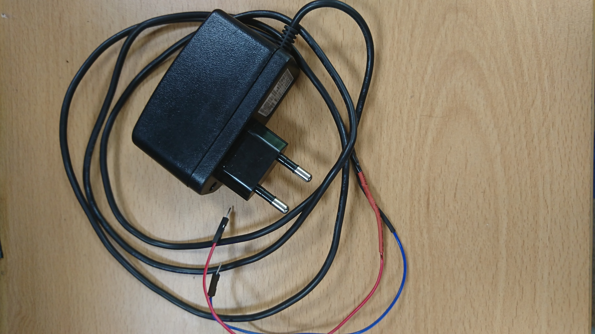

# Smart Farm Project 🌱

실내, 홈 가드닝을 위한 Smart Farm Project 입니다.

> __Smart Farm 기능__  
>> 1. 조도에 따른 LED센서 ON/OFF  
>> 2. LED센서 밝기 단계별 조절 기능(UI)  
>> 3. 현재 대기 온도에 따른 FAN ON/OFF  
>> 4. 토양 습도 값에 따른 Water Pump ON/OFF  
>> 5. 온습도 센서 측정 값 Smart Farm Kit LCD에 출력  
>> 6. 수위 센서를 통한 수통 잔여 물 양 확인(UI)  
>> 7. 카메라 모듈로 실시간 식물 상태 확인 기능(UI)  
>> 8. FAN, LED, Water Pump, 토양 습도 센서 수동 조작(UI)  

## Smart Farm Project Members (5명)

__- 강동훈__  
__- 정재윤__  
__- 하진우__  
__- 허상현__  
__- 조희지__  

## 진척상황

### MileStone

     
    <b>SmartFarm DEMO</b>

---

### 21.08.02 (월)

     
     
    <b>SmartFarm DEMO</b>

- Flask Demo 파이썬 코드 작성 
- 실시간 스트리밍 코드 작성 
- CSS, HTML 작성 

---

### 21.08.03 (화)

- Ajax 데모 코드 작성 

     
     
    <b>워터펌프, 조도센서</b>

- 워터 펌프 가동 확인 및 데모 코드 (릴레이 모듈 제어) 작성 
- 조도 센서 확인 및 데모 코드 (밝기별 전압) 작성 

---

### 21.08.04 (수)

     
    <b>LED 센서</b>

- LED 센서 확인 및 데모 코드 (단계별 조절) 작성 

     
    <b>센서 버튼 동작 확인</b>

- Ajax 코드 (웹 컨트롤러 버튼 동작), JS 코드 작성 
- js, css 파일 캐싱 문제 해결 

---

### 21.08.05 (목)

     
    <b>온습도 센서 및 결과 LCD 출력</b>

- 온습도 센서 및 I2C LCD 모듈 확인 및 데모 코드 (온습도 표기) 작성 

---

### 21.08.06 (금)

     
    <b>DC 5V 전원 공급 장치 튜닝</b>

- DC 5V 전원 공급 어댑터 튜닝 

     
    <b>수위 측정 센서 및 토양 수분 센서</b>

- 수위 센서 확인 및 데모 코드 (전위차) 작성 
- 토양 수분 센서 확인 및 데모 코드 (전위차) 작성 

     
    <b>라즈베리파이 핀 배치도</b>

     
    <b>브레드 보드 #1 배치도</b>

 

     
    <b>브레드 보드 #2 배치도</b>

 
   
- 라즈베리파이 GPIO 핀 배치도 구성 

#### Issue
> - MCP3008 모듈 고장, 다음 주 수요일(21-08-11)까지 배송 예정 
> - 센서 측정 값 비일관적, 해결 방법 모색 

---

### 21.08.09 (월)

     
    <b>임시 핀 배치</b>
     
    <b>모듈 일부 고정</b>

 

- Raspberry Pi 핀 / Bread Board 임시 배치, Smart Farm 모듈 일부 고정 

     
    <b>UI 일부 수정</b>

 

- UI 부분 삭제, 생성 및 변경 
> 1. FAN 버튼 우측 상단과 하단측 중복 
> 2. UI 부분 리프레시 버튼 추가 

---

### 21.08.10 (화)

     
    <b>릴레이 센서 동작 확인</b>

 

- 배치도에 따른 동작 확인 

     
    <b>Smart Farm Database & SQL</b>

 

- Smart Farm Database 및 SQL 작성 

---

### 21.08.11 (수)

- UI 재배치 및 버튼(토양 수분 센서 측정) 추가 
- GPIO 코드 (웹 UI 위젯 클릭 시 센서 제어 기능, 주기적인 측정), JS 코드 작성 

---

### 21.08.12 (목)

- 배선 작업 
